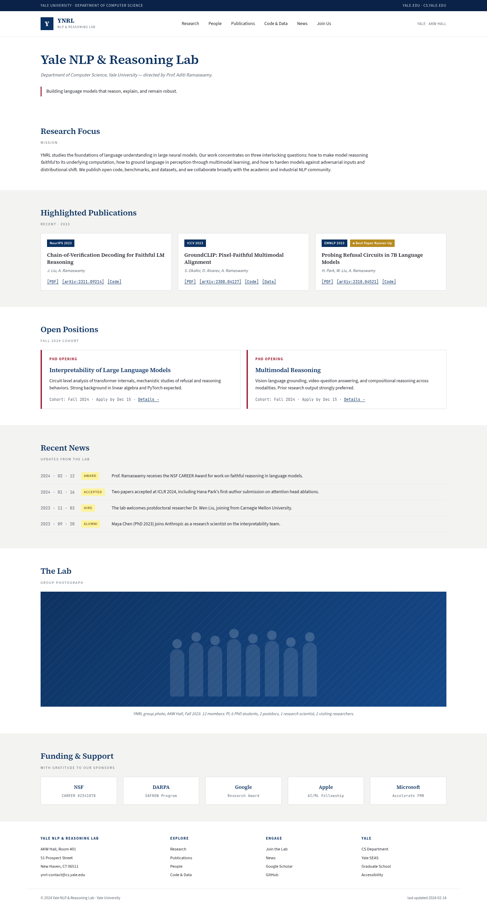
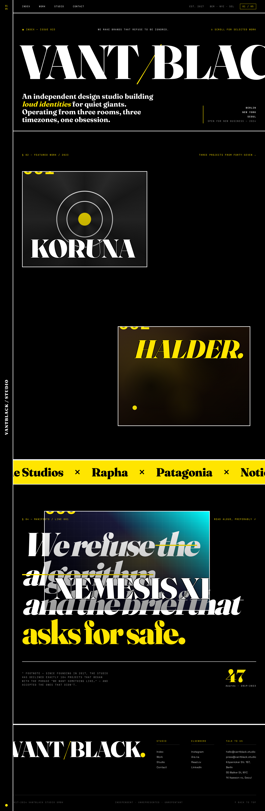
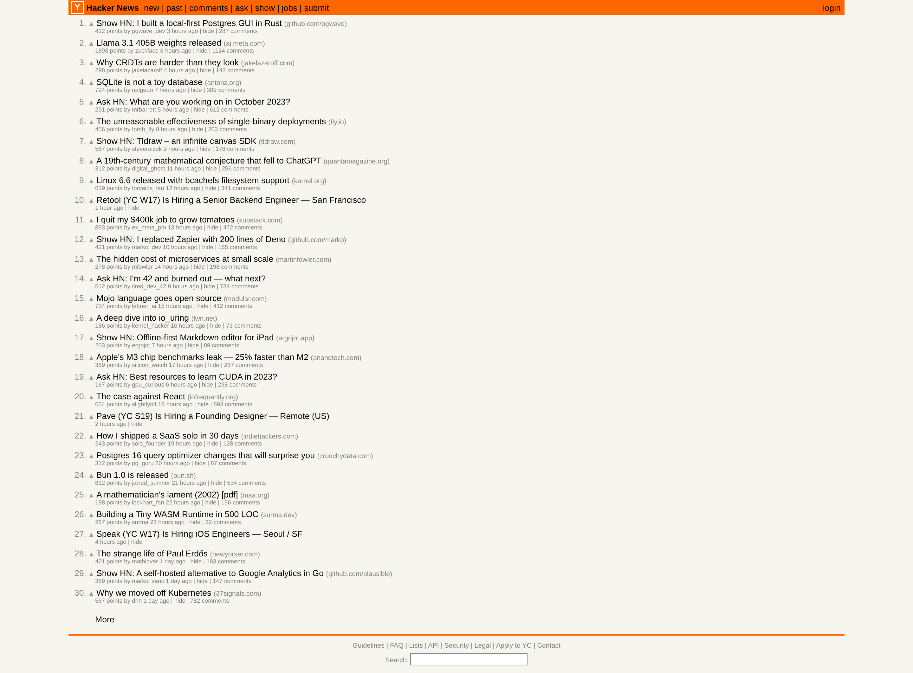

# Web Design RL: A Scalable Environment for Benchmarking Design-to-Code Agents

## Introduction

This project builds a scalable pipeline for creating reinforcement learning environments that test a coding agent's ability to replicate multi-page website designs in HTML and CSS. The core setup is simple: an agent receives full-page screenshots of a website, writes code to reproduce the design, and receives a continuous reward score measuring how closely the rendered output matches the original.

What makes the problem rich is that visual similarity is not binary. An agent that gets the layout structure right but uses the wrong brand colors, or one that nails the color palette but collapses the grid, should score differently. This requires a grader that can distinguish gradations of quality across structure, content, and visual design simultaneously. Building such a grader - and proving it actually works - is the central technical contribution of this work.

The pipeline has three parts: a generation system that creates diverse fictional websites from scratch, a Harbor-based task packaging system that wraps each site as an agent evaluation environment, and a visual similarity evaluation system with a built-in validation harness to prove the grader's correctness.

---

## Part 1: Data Generation

### DNA-Driven Website Generation

The generation pipeline avoids crawling real websites. Instead, every site is described by a hand-crafted `site_dna.json` file - a structured natural language specification that defines the archetype, market, era, visual density, navigation style, color palette, typography, and page structure. All DNA values are natural language strings, not enums. This forces creative variance: `"density": "Extremely cramped. Every pixel is occupied. Multiple competing visual hierarchies."` is far more useful to a generation model than `"density": "high"`.

Thirty DNA files were created across two categories: 20 *reference-anchored* archetypes (Indian government portal, Japanese dense news site, Hacker News clone, NHS health portal, Korean beauty brand, etc.) and 10 *pure AI* archetypes (indie portfolio, climate nonprofit, coworking space, community events platform, etc.). Approximately 10 sites include CSS animations.

### Four-Step Pipeline

Each DNA file passes through four sequential steps, each calling Claude Opus 4.7:

1. **Blueprint** - invents a fictional brand with real content: names, copy, prices, announcements, personnel. No Lorem Ipsum.
2. **Designer** - produces a complete visual specification with exact hex codes, font sizes, spacing values, and per-page layout descriptions.
3. **Coder** - generates one self-contained HTML file per page. All CSS is inline in a `<style>` tag. No external stylesheets. Google Fonts via `@import` is permitted.
4. **Renderer** - serves each HTML file locally via a minimal HTTP server and captures full-page screenshots at 1440px viewport width using Playwright headless Chromium, at 2× device pixel ratio for OCR accuracy.

Each task directory contains the ground-truth HTML source, screenshots, and intermediate generation artifacts. Ten tasks with CSS animations also include screen recordings captured via Playwright's `recordVideo` API, scrolling the page from top to bottom to show on-load and scroll-triggered motion.

### Distribution

The 30 tasks span a wide range of design languages, eras, and densities - from the dense, table-heavy aesthetic of a [2018 Indian government ministry portal](tasks/task_001_indian_govt/harbor/environment/task_screenshots/home.png) to the typographically minimal, dark-background layouts of a [modern SaaS product](tasks/task_016_saas_dark/harbor/environment/task_screenshots/home.png). Other archetypes include a [Japanese dense news site](tasks/task_002_japanese_news/harbor/environment/task_screenshots/home.png), a [Korean beauty brand](tasks/task_011_korean_beauty/harbor/environment/task_screenshots/home.png), a [brutalist design agency](tasks/task_017_brutalist_agency/harbor/environment/task_screenshots/home.png), and a [food delivery app](tasks/task_014_food_delivery/harbor/environment/task_screenshots/home.png). This range is intentional: an RL reward signal trained only on clean, modern designs would fail to generalize to the real diversity of the web.

---

## Part 2: Agent Task Packaging

Each generated site is packaged as a Harbor task. Harbor is a framework for running agent evaluations in isolated Docker containers. The agent receives ground-truth screenshots and must produce matching HTML/CSS files under `/app/site/`.

A separate verifier container renders the agent's HTML with Playwright at the same 1440px viewport, captures screenshots, and writes a `reward.json` file. The default verifier uses a completeness checker (`score = rendered_pages / total_pages`) as an initial signal during agent runs.

The instruction given to the agent specifies: plain HTML + CSS + vanilla JS only, no frameworks, all CSS self-contained, pages must render at exactly 1440px with no horizontal overflow. For animated tasks, screen recordings are provided alongside screenshots and the agent is asked to replicate CSS animations.

All 30 tasks were run against Claude Code with Opus 4.7, producing real agent outputs that are evaluated by the visual similarity system described below.

---

## Part 3: Visual Similarity Evaluation

### Design Philosophy

The grader is **image-only**: it accepts two screenshots (ground truth and agent output) and returns a score in [0, 1]. No HTML source is used at grading time. This constraint is deliberate - it makes the grader framework-agnostic, meaning it would work identically if the agent produced React, Tailwind, or SolidJS output instead of plain HTML. The only universal, framework-invariant comparison surface is the rendered screenshot.

### Scoring Equation

```
final_score = topology × (weighted_content + design_score) / 2

content_score(i) = word-set F1 between GT section i words and agent section i words

design_score = mean(color/5, typography/5, assets/5, proportion/5, states/5)

topology = present_sections / total_gt_sections − ordering_penalty

weighted_content = Σᵢ content_score(i) × type_weight(i)
                   ────────────────────────────────────────
                            Σᵢ type_weight(i)
```

**type_weights:** form_step=1.0, pricing=1.0, sidebar=0.8, hero=0.7, media=0.6, map=0.5, navigation=0.4, generic=0.4, footer=0.2

### Three Signals

**Topology** measures structural fidelity - are the right sections present and in the right order? An LLM looks at the ground truth screenshot and outputs an ordered list of semantic sections with their vertical bounds (as fractions of image height). Python then OCRs both images, buckets words into sections by y-position, and computes what fraction of GT sections are present in the agent output. An ordering penalty (capped at 0.2) penalises sections that appear in the wrong vertical order. Topology acts as a **multiplier**: structural failure cannot be compensated by high per-section scores.

**Content score** measures whether the right text, numbers, and labels appear in each section. OCR extracts word lists from both images at 1440px, and for each matched section pair, token-level F1 is computed over word multisets. This catches wrong prices, missing ticket tiers, incorrect button labels - things that look fine visually but contain the wrong information.

**Design score** is a single full-page LLM vision call scoring five directed dimensions on a 1–5 Likert scale, each with a one-sentence reason. The prompt is explicitly **content-blind** - the model is instructed to ignore what the text says and focus only on visual design properties:

| Dimension | Scope |
|---|---|
| **color** | Brand accent colors on CTAs/buttons, gradient fills, badge/pill backgrounds, icon colors, nav link colors |
| **typography** | Heading weight vs body, button/label font weight, badge/pill text styling, nav link styling |
| **assets** | Icon rendering (real vs placeholder boxes), emoji presence, decorative images, avatar placeholders |
| **proportion** | Button padding/size, pill/badge sizing, spacing between form elements, nav item density |
| **states** | Selected/active pill states, active nav items, filled vs outline buttons, focused inputs |

Each dimension score is normalized to [0, 1] and averaged. The LLM never produces the final number - it produces detection and classification, and the number is computed deterministically from its structured output.

### OCR Quality

All screenshots are rendered at 2× device pixel ratio (2880px wide). This dramatically improves OCR accuracy on coloured-background text - nav bars, orange headers, utility bars - that tesseract frequently misses at 1×. For LLM API calls, images are halved back to 1440px to stay within the 8000px dimension limit.

### Interpretability

Every evaluation produces a `reward.json` with a per-section breakdown: word counts, content F1, design dimension scores with reasons, and a one-sentence natural language explanation of the two most important failures. This makes the reward signal auditable - a score of 0.71 is not a black box.

---

## EVAL'S EVAL: Validating the Grader

The core claim of any RL reward function is that higher scores correspond to better outputs. We validate this formally by fabricating degraded versions of ground truth pages at known relative quality, then checking whether each grader reproduces the correct ranking.

### Methodology

For 5 representative pages spanning dense government portal ([task_001](tasks/task_001_indian_govt/harbor/environment/task_screenshots/home.png)), minimal text-heavy ([task_008 Hacker News](tasks/task_008_hacker_news/harbor/environment/task_screenshots/home.png)), image-heavy editorial ([task_018 luxury fashion](tasks/task_018_luxury_fashion/harbor/environment/task_screenshots/home.png)), clean academic ([task_028 research lab](tasks/task_028_research_lab/harbor/environment/task_screenshots/home.png)), and complex form ([task_030 community events](tasks/task_030_community_events/harbor/environment/task_screenshots/home.png)), we fabricate 22 variants per page:

**Degradations (known ordering):**
- `identity` - exact copy (tier 1, must score highest)
- `font_swap`, `recolor`, `typography_drift` - minor design mutations (tier 2)
- `section_delete`, `band_delete`, `dim_*` - moderate structural/design damage (tier 2–4)
- `grayscale`, `band_shuffle` - heavy damage (tier 3–5)
- `blank_white` - must score near zero (tier 6)

**Adversarial traps:**
- `trap_bg_color_blank` - blank page painted with GT's dominant background color (fools color-only metrics)
- `trap_solid_block` - solid grey rectangle (fools SSIM-style metrics)
- `trap_text_dump` - GT text in unstyled paragraphs (fools content-only metrics)
- `trap_layout_content_wrong` - correct layout and colors, all text replaced with filler (should expose over-reliance on visual similarity alone)
- `trap_content_design_broken` - correct text, wildly wrong fonts/colors (should expose content-only metrics)
- `trap_polished_different` - a different page from the same task (well-designed but wrong; grader must reward similarity, not generic quality)
- Per-dimension traps targeting each design rubric dimension individually

### Metrics

- **rank_fidelity** - fraction of known-ordered variant pairs the method ranks correctly (1.0 = perfect)
- **dynamic_span** - `score(identity) − score(blank_white)` - how much of the [0,1] range the grader actually uses
- **trap_rejection** - fraction of trap cases scored below the worst real degradation

### Results

| Method | Avg rank_fidelity | Avg dynamic_span | trap_std | trap_llm |
|---|---|---|---|---|
| **ours** | **0.744** | 0.762 | 1.0 | 1.0 |
| vlm_only | 0.652 | 0.792 | 1.0 | 1.0 |
| content_only | 0.616 | 1.000 | 1.0 | 1.0 |
| design2code† | 0.620 | 0.800 | 1.0 | 1.0 |

† design2code uses image-only block detection (OCR + edge contours) instead of the canonical HTML-based detector, labelled "design2code-style (image-only)".


**Key findings:**

1. **Our grader leads on visually complex pages.** On luxury fashion (0.840), research lab (0.840), and community events (0.880), our grader outperforms all baselines. On simpler pages like Hacker News it underperforms content_only - which is expected, since HN is nearly all text.

2. **CLIP is useless as an RL reward.** Despite appearing to rank variants correctly, it does so only because it scores everything identically. An RL agent receiving CLIP as a reward signal would receive a flat gradient - no learning signal at all.

3. **Content-only is blind to design failures.** `trap_dim_color`, `trap_dim_typography`, `trap_dim_proportion` and `trap_dim_states` all receive near-identity scores from content_only, since the text is unchanged. Our grader correctly penalises these because the design judge observes the visual changes.

4. **All methods catch standard traps.** trap_rejection_standard = 1.0 for all methods - blank pages, solid blocks, and text dumps are universally identified as low-quality. The differentiation is in the LLM-specific traps.

---

## EVAL: Agent Performance Across 30 Tasks

All 30 tasks were evaluated using our custom grader. The agent is Claude Code with Opus 4.7, run once per task.

| Task | Score | GT | Generated | Notable |
|---|---|---|---|---|
| [task_028_research_lab](tasks/task_028_research_lab/harbor/environment/task_screenshots/home.png) | **0.751** | [GT](tasks/task_028_research_lab/harbor/environment/task_screenshots/home.png) | [agent](tasks/task_028_research_lab/agent_result/agent_screenshots/home.png) | Clean text-heavy layout, strong content match |
| [task_024_coworking](tasks/task_024_coworking/harbor/environment/task_screenshots/home.png) | 0.707 | [GT](tasks/task_024_coworking/harbor/environment/task_screenshots/home.png) | [agent](tasks/task_024_coworking/agent_result/agent_screenshots/home.png) | |
| [task_021_b2b_saas](tasks/task_021_b2b_saas/harbor/environment/task_screenshots/home.png) | 0.695 | [GT](tasks/task_021_b2b_saas/harbor/environment/task_screenshots/home.png) | [agent](tasks/task_021_b2b_saas/agent_result/agent_screenshots/home.png) | |
| [task_030_community_events](tasks/task_030_community_events/harbor/environment/task_screenshots/home.png) | 0.666 | [GT](tasks/task_030_community_events/harbor/environment/task_screenshots/home.png) | [agent](tasks/task_030_community_events/agent_result/agent_screenshots/home.png) | |
| [task_023_nonprofit_climate](tasks/task_023_nonprofit_climate/harbor/environment/task_screenshots/home.png) | 0.653 | [GT](tasks/task_023_nonprofit_climate/harbor/environment/task_screenshots/home.png) | [agent](tasks/task_023_nonprofit_climate/agent_result/agent_screenshots/home.png) | |
| [task_013_aus_real_estate](tasks/task_013_aus_real_estate/harbor/environment/task_screenshots/home.png) | 0.621 | [GT](tasks/task_013_aus_real_estate/harbor/environment/task_screenshots/home.png) | [agent](tasks/task_013_aus_real_estate/agent_result/agent_screenshots/home.png) | |
| [task_014_food_delivery](tasks/task_014_food_delivery/harbor/environment/task_screenshots/home.png) | 0.618 | [GT](tasks/task_014_food_delivery/harbor/environment/task_screenshots/home.png) | [agent](tasks/task_014_food_delivery/agent_result/agent_screenshots/home.png) | |
| [task_003_classifieds](tasks/task_003_classifieds/harbor/environment/task_screenshots/home.png) | 0.615 | [GT](tasks/task_003_classifieds/harbor/environment/task_screenshots/home.png) | [agent](tasks/task_003_classifieds/agent_result/agent_screenshots/home.png) | |
| [task_006_nigerian_fintech](tasks/task_006_nigerian_fintech/harbor/environment/task_screenshots/home.png) | 0.614 | [GT](tasks/task_006_nigerian_fintech/harbor/environment/task_screenshots/home.png) | [agent](tasks/task_006_nigerian_fintech/agent_result/agent_screenshots/home.png) | |
| [task_012_nhs_health](tasks/task_012_nhs_health/harbor/environment/task_screenshots/home.png) | 0.594 | [GT](tasks/task_012_nhs_health/harbor/environment/task_screenshots/home.png) | [agent](tasks/task_012_nhs_health/agent_result/agent_screenshots/home.png) | |
| [task_029_restaurant_group](tasks/task_029_restaurant_group/harbor/environment/task_screenshots/home.png) | 0.590 | [GT](tasks/task_029_restaurant_group/harbor/environment/task_screenshots/home.png) | [agent](tasks/task_029_restaurant_group/agent_result/agent_screenshots/home.png) | |
| [task_027_hardware_startup](tasks/task_027_hardware_startup/harbor/environment/task_screenshots/home.png) | 0.550 | [GT](tasks/task_027_hardware_startup/harbor/environment/task_screenshots/home.png) | [agent](tasks/task_027_hardware_startup/agent_result/agent_screenshots/home.png) | |
| [task_007_latam_telco](tasks/task_007_latam_telco/harbor/environment/task_screenshots/home.png) | 0.510 | [GT](tasks/task_007_latam_telco/harbor/environment/task_screenshots/home.png) | [agent](tasks/task_007_latam_telco/agent_result/agent_screenshots/home.png) | |
| [task_008_hacker_news](tasks/task_008_hacker_news/harbor/environment/task_screenshots/home.png) | 0.507 | [GT](tasks/task_008_hacker_news/harbor/environment/task_screenshots/home.png) | [agent](tasks/task_008_hacker_news/agent_result/agent_screenshots/home.png) | design=0.99 but content gaps |
| [task_015_crypto_project](tasks/task_015_crypto_project/harbor/environment/task_screenshots/home.png) | 0.496 | [GT](tasks/task_015_crypto_project/harbor/environment/task_screenshots/home.png) | [agent](tasks/task_015_crypto_project/agent_result/agent_screenshots/home.png) | |
| [task_025_podcast_network](tasks/task_025_podcast_network/harbor/environment/task_screenshots/home.png) | 0.493 | [GT](tasks/task_025_podcast_network/harbor/environment/task_screenshots/home.png) | [agent](tasks/task_025_podcast_network/agent_result/agent_screenshots/home.png) | |
| [task_005_early_corporate](tasks/task_005_early_corporate/harbor/environment/task_screenshots/home.png) | 0.456 | [GT](tasks/task_005_early_corporate/harbor/environment/task_screenshots/home.png) | [agent](tasks/task_005_early_corporate/agent_result/agent_screenshots/home.png) | |
| [task_022_indie_portfolio](tasks/task_022_indie_portfolio/harbor/environment/task_screenshots/home.png) | 0.432 | [GT](tasks/task_022_indie_portfolio/harbor/environment/task_screenshots/home.png) | [agent](tasks/task_022_indie_portfolio/agent_result/agent_screenshots/home.png) | |
| [task_010_russian_ecommerce](tasks/task_010_russian_ecommerce/harbor/environment/task_screenshots/home.png) | 0.430 | [GT](tasks/task_010_russian_ecommerce/harbor/environment/task_screenshots/home.png) | [agent](tasks/task_010_russian_ecommerce/agent_result/agent_screenshots/home.png) | |
| [task_001_indian_govt](tasks/task_001_indian_govt/harbor/environment/task_screenshots/home.png) | 0.428 | [GT](tasks/task_001_indian_govt/harbor/environment/task_screenshots/home.png) | [agent](tasks/task_001_indian_govt/agent_result/agent_screenshots/home.png) | topology bottleneck |
| [task_004_tabloid](tasks/task_004_tabloid/harbor/environment/task_screenshots/home.png) | 0.386 | [GT](tasks/task_004_tabloid/harbor/environment/task_screenshots/home.png) | [agent](tasks/task_004_tabloid/agent_result/agent_screenshots/home.png) | |
| [task_002_japanese_news](tasks/task_002_japanese_news/harbor/environment/task_screenshots/home.png) | 0.376 | [GT](tasks/task_002_japanese_news/harbor/environment/task_screenshots/home.png) | [agent](tasks/task_002_japanese_news/agent_result/agent_screenshots/home.png) | |
| [task_019_esports_hub](tasks/task_019_esports_hub/harbor/environment/task_screenshots/home.png) | 0.359 | [GT](tasks/task_019_esports_hub/harbor/environment/task_screenshots/home.png) | [agent](tasks/task_019_esports_hub/agent_result/agent_screenshots/home.png) | |
| [task_011_korean_beauty](tasks/task_011_korean_beauty/harbor/environment/task_screenshots/home.png) | 0.358 | [GT](tasks/task_011_korean_beauty/harbor/environment/task_screenshots/home.png) | [agent](tasks/task_011_korean_beauty/agent_result/agent_screenshots/home.png) | |
| [task_026_yoga_wellness](tasks/task_026_yoga_wellness/harbor/environment/task_screenshots/home.png) | 0.356 | [GT](tasks/task_026_yoga_wellness/harbor/environment/task_screenshots/home.png) | [agent](tasks/task_026_yoga_wellness/agent_result/agent_screenshots/home.png) | |
| [task_009_retro_forum](tasks/task_009_retro_forum/harbor/environment/task_screenshots/home.png) | 0.355 | [GT](tasks/task_009_retro_forum/harbor/environment/task_screenshots/home.png) | [agent](tasks/task_009_retro_forum/agent_result/agent_screenshots/home.png) | |
| [task_016_saas_dark](tasks/task_016_saas_dark/harbor/environment/task_screenshots/home.png) | 0.352 | [GT](tasks/task_016_saas_dark/harbor/environment/task_screenshots/home.png) | [agent](tasks/task_016_saas_dark/agent_result/agent_screenshots/home.png) | |
| [task_020_docs_site](tasks/task_020_docs_site/harbor/environment/task_screenshots/home.png) | 0.350 | [GT](tasks/task_020_docs_site/harbor/environment/task_screenshots/home.png) | [agent](tasks/task_020_docs_site/agent_result/agent_screenshots/home.png) | |
| [task_018_luxury_fashion](tasks/task_018_luxury_fashion/harbor/environment/task_screenshots/home.png) | 0.316 | [GT](tasks/task_018_luxury_fashion/harbor/environment/task_screenshots/home.png) | [agent](tasks/task_018_luxury_fashion/agent_result/agent_screenshots/home.png) | image-heavy, asset-dependent |
| [task_017_brutalist_agency](tasks/task_017_brutalist_agency/harbor/environment/task_screenshots/home.png) | **0.281** | [GT](tasks/task_017_brutalist_agency/harbor/environment/task_screenshots/home.png) | [agent](tasks/task_017_brutalist_agency/agent_result/agent_screenshots/home.png) | viewport overflow + missing assets |

**Overall average: 0.497**

### Illustrative Examples

**High score - Research Lab (0.751):** GT vs Agent

[](tasks/task_028_research_lab/harbor/environment/task_screenshots/home.png) [](tasks/task_028_research_lab/agent_result/agent_screenshots/home.png)

**Low score - Brutalist Agency (0.281):** GT vs Agent

[](tasks/task_017_brutalist_agency/harbor/environment/task_screenshots/home.png) [](tasks/task_017_brutalist_agency/agent_result/agent_screenshots/home.png)

**Mid score - Hacker News (0.507):** GT vs Agent (design=0.99, topology bottleneck)

[](tasks/task_008_hacker_news/harbor/environment/task_screenshots/home.png) [](tasks/task_008_hacker_news/agent_result/agent_screenshots/home.png)


### Common Failure Patterns

Analysis of per-page explanations across all 30 tasks reveals consistent failure modes:

**Icons rendered as placeholder boxes.** The most frequent failure across all tasks. The agent produces the correct HTML structure but fails to embed the correct icon assets - emojis render as question marks, SVG icons as grey boxes, social media glyphs as empty squares. This affects design score (assets dimension) but not content score, making it invisible to content-only metrics.

**Missing nav and utility bar content.** Top navigation bars, utility toolbars, and footer link columns consistently score near zero on content F1. These regions often contain text rendered in colored backgrounds or small type that OCR struggles to extract, causing the agent to omit or misplace them.

**Wrong brand color.** Color dimension scores of 2–3/5 are common. The agent captures the correct hue family but not the exact brand values - orange becomes peach, navy becomes blue, gradients lose their specific stop positions. This is imperceptible at a glance but caught by the directed color rubric.

**Topology bottleneck on dense pages.** The [Indian government portal](tasks/task_001_indian_govt/harbor/environment/task_screenshots/home.png) (0.43) and [Japanese news site](tasks/task_002_japanese_news/harbor/environment/task_screenshots/home.png) (0.38) both score below average primarily because the LLM segmenter identifies fewer sections than are present - the pages are so dense that sections blend together visually. This is a known limitation of the image-only section detection approach.

**Viewport overflow.** [Task 017 (brutalist agency)](tasks/task_017_brutalist_agency/harbor/environment/task_screenshots/home.png) includes pages where the agent HTML rendered at 4634px wide instead of 1440px - the agent produced a layout that overflowed horizontally. This produces an aspect ratio mismatch making comparison nearly meaningless. The grader correctly scores these low.

**Collapsed grid layouts.** Complex CSS grid and masonry layouts frequently collapse to single-column stacks. The agent produces structurally correct HTML but the CSS grid properties are wrong, resulting in a layout that looks like the right content in the wrong arrangement.

---

## Discussion

The central tension in this work is between two definitions of a "good" grader: one that correctly ranks agent outputs by quality, and one that is hard to game. These are related but distinct. A grader that only measures pixel similarity can be gamed by producing the right background color. A grader that only measures text content can be gamed by rendering the correct words in completely wrong styling.

Our grader addresses this by combining three signals that measure different failure modes and are difficult to jointly optimize without actually replicating the design:
- Topology catches structural failures that content and design signals miss
- Content F1 catches wrong text that visual metrics are too robust to notice
- The design judge catches color, typography, and asset failures invisible to OCR

The EVAL'S EVAL results confirm that no single signal dominates across all page types. On text-heavy minimal pages, content_only is nearly as effective as our combined grader. On visually complex pages with rich brand color, iconography, and interactive states, the LLM design judge is essential. The combined grader achieves the best average rank fidelity precisely because it is robust across both regimes.

The image-only constraint - no HTML at grading time - is not just a technical choice. It is the correct choice for a framework-agnostic benchmark that should remain valid as agents move from plain HTML to React, Tailwind, SolidJS, or future frameworks. The rendered screenshot is the only artifact that all frameworks share.
